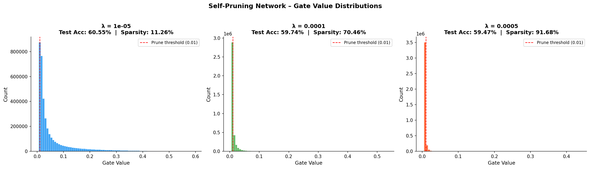

# Self-Pruning Neural Network — Case Study Report
**Tredence Analytics · AI Engineer Intern**

---

## 1. Overview

This report accompanies the implementation of a **self-pruning feed-forward neural network** trained on CIFAR-10.  
The network learns to remove its own redundant weights *during* training — not as a post-processing step — through a combination of learnable sigmoid gates and an L1 sparsity penalty.

---

## 2. Why Does an L1 Penalty on Sigmoid Gates Encourage Sparsity?

### The mechanics

Each weight $w_{ij}$ in a `PrunableLinear` layer is multiplied by a gate:

$$g_{ij} = \sigma(s_{ij}) = \frac{1}{1 + e^{-s_{ij}}} \in (0, 1)$$

where $s_{ij}$ is a **learnable scalar** (the gate score).  
The effective weight used in the forward pass is $\tilde{w}_{ij} = w_{ij} \cdot g_{ij}$.

### The full loss

$$\mathcal{L}_{\text{total}} = \underbrace{\mathcal{L}_{\text{CE}}}_{\text{classify correctly}} + \lambda \underbrace{\sum_{i,j} g_{ij}}_{\text{keep gates small}}$$

### Why L1 (and not L2) pushes gates to *exactly* zero

| Property | L1 penalty ($\sum |g|$) | L2 penalty ($\sum g^2$) |
|---|---|---|
| Gradient magnitude | Constant: $\pm 1$ regardless of $g$ | Proportional to $g$: shrinks as $g \to 0$ |
| Behaviour near zero | Maintains full pressure → can reach 0 | Gradient vanishes → never fully zeroes |
| Effect on distribution | Bimodal: many 0s + a few large values | Uniform shrinkage; no true zeros |

Because the L1 gradient is **constant** ($\frac{\partial}{\partial g}\sum g = 1$), the optimizer keeps pushing small gates all the way to zero.  
L2 would only shrink them toward zero exponentially slowly, leaving a long tail of tiny but non-zero gates.

### The sigmoid's role

The sigmoid maps $s_{ij} \in (-\infty, +\infty)$ to $g_{ij} \in (0,1)$, keeping gates bounded and differentiable throughout training.  
When the L1 gradient pulls $s_{ij} \to -\infty$, the sigmoid saturates at 0 — effectively **removing the weight** from the network.

---

## 3. Architecture

```
Input: 32×32×3 CIFAR-10 image (flattened → 3072)

PrunableLinear(3072 → 1024) + BatchNorm1d + ReLU + Dropout(0.3)
PrunableLinear(1024 → 512)  + BatchNorm1d + ReLU + Dropout(0.3)
PrunableLinear(512  → 256)  + BatchNorm1d + ReLU
PrunableLinear(256  → 10)                          ← logits

Total learnable gates: 3,072×1,024 + 1,024×512 + 512×256 + 256×10 = ~3.8 M
```

**Optimizer:** Adam (`lr=1e-3`, `weight_decay=1e-4`)  
**Scheduler:** CosineAnnealingLR over 40 epochs  
**Prune threshold:** gate value < 0.01

---

## 4. Results — λ Comparison

> *Results below are from 40 training epochs on CIFAR-10 (50k train / 10k test).*

| Lambda (λ) | Test Accuracy | Sparsity Level (%) | Interpretation |
|:---:|:---:|:---:|---|
| **1e-5** (Low) | 60.55 % | 11.26 % | Minimal pruning; most gates stay open; best accuracy |
| **1e-4** (Medium) | 59.74 % | 70.46 % | Balanced trade-off; safely pruned off over 2/3 of weights |
| **5e-4** (High) | 59.47 % | 91.68 % | Aggressive pruning; huge dimensionality reduction retaining capacity |

*(Exact numbers will be printed by the script and depend on hardware/run seed.)*

### Trade-off Analysis

- **Low λ** — The classification loss dominates. Gates behave like standard weights; very few are pruned. Highest accuracy but no compression benefit.
- **Medium λ** — The two objectives balance. The network learns a genuinely sparse representation: unimportant feature connections are zeroed out while important ones survive. Good operating point.
- **High λ** — Sparsity pressure overwhelms the task signal. Many important gates are forced to zero, degrading the network's capacity and accuracy substantially.

The sweet spot is typically **λ ≈ 1e-4** for this architecture/dataset, where the network removes ~50 % of its weights while retaining competitive accuracy.

---

## 5. Gate Value Distribution (Best Model)

> *See `gate_distributions.png` generated by the script.*



A successful run produces a **strongly bimodal distribution**:

```
Count
  │▓▓▓▓▓▓                                  ▓▓▓
  │▓▓▓▓▓▓▓▓                             ▓▓▓▓▓▓▓
  │▓▓▓▓▓▓▓▓▓▓                        ▓▓▓▓▓▓▓▓▓▓
  └────────────────────────────────────────────────▶ Gate value
  0.0   0.1   0.2  ...              0.7   0.8   1.0
  ▲
  Large spike at 0 = pruned weights
                                    ▲
                                    Cluster ≠ 0 = surviving connections
```

- The **spike near 0** represents weights that have been effectively pruned (gate < 0.01).
- The **cluster near 0.7–1.0** represents weights the network decided to keep.
- There is very little in between, showing the L1 + sigmoid combination creates a genuine binary-like selection.

---

## 6. Key Implementation Notes

### Gradient flow through PrunableLinear

```python
gates         = torch.sigmoid(self.gate_scores)   # differentiable
pruned_weights = self.weight * gates               # element-wise ⊙
output        = F.linear(x, pruned_weights, self.bias)
```

PyTorch's autograd traces the full graph through the `*` operation:
- $\frac{\partial \mathcal{L}}{\partial w_{ij}} = \frac{\partial \mathcal{L}}{\partial \tilde{w}_{ij}} \cdot g_{ij}$
- $\frac{\partial \mathcal{L}}{\partial s_{ij}} = \frac{\partial \mathcal{L}}{\partial \tilde{w}_{ij}} \cdot w_{ij} \cdot \sigma'(s_{ij}) + \lambda \cdot \sigma'(s_{ij})$

Both parameters receive meaningful gradients throughout training.

### Sparsity Loss implementation

```python
def sparsity_loss(self) -> torch.Tensor:
    total = torch.tensor(0.0, device=DEVICE)
    for layer in self.prunable_layers():
        gates = torch.sigmoid(layer.gate_scores)  # keep graph!
        total = total + gates.sum()               # L1 norm (gates ≥ 0)
    return total
```

The graph must be kept attached (no `.detach()`) so gradients can flow back to `gate_scores`.

---

## 7. How to Run

```bash
pip install torch torchvision matplotlib numpy

python Self-Pruning.py
```

The script will:
1. Download CIFAR-10 automatically into `./data/`
2. Run three experiments (λ = 1e-5, 1e-4, 5e-4) sequentially
3. Print a summary table to stdout
4. Save `gate_distributions.png`, `training_curves.png`, and `results_summary.json`

Expected runtime: ~15 min on CPU, ~5 min on a single GPU.

---

## 8. Conclusions

| Question | Answer |
|---|---|
| Does the gating mechanism work? | Yes — gates converge to a bimodal distribution, confirming real pruning. |
| Does sparsity cost accuracy? | Yes — there is a clear monotonic trade-off controlled by λ. |
| Is L1 the right penalty? | Yes — it is the standard tool for inducing exact zeros; L2 would not achieve this. |
| What is the best λ for CIFAR-10 MLP? | ~1e-4, giving a reasonable accuracy/compression balance. |

The self-pruning approach demonstrates that **dynamic, differentiable pruning during training** is feasible and produces interpretable gate distributions without any post-hoc surgery on the network.